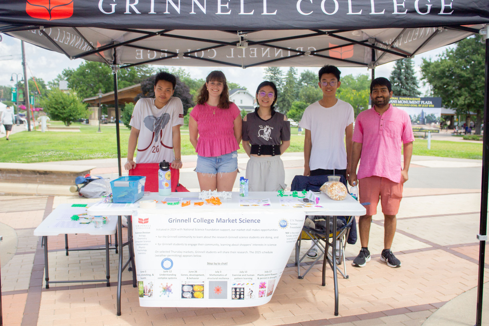
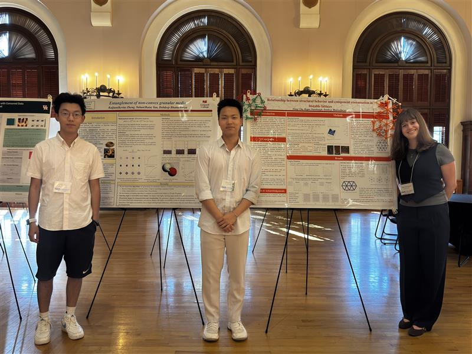
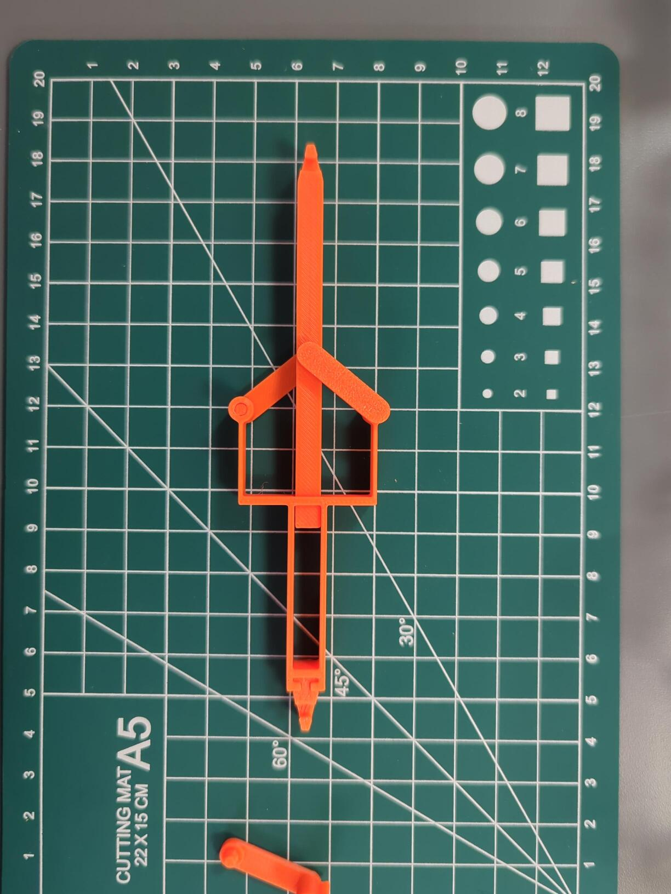
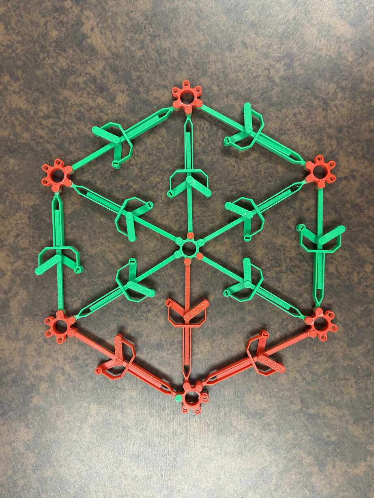



I am happy to hear from students who are interested in learning more about applied and computational mathematics, in particular, about mathematics of materials. If you are interested in working together, please feel free to get in touch via email. 

- Students presented their work at the Grinnell Farmer's Market as a part of the [Grinnell Market Science](https://www.grinnell.edu/news/market-science-program-engaging-community-through-research), an innovative public engagement initiative to make science research more accessible to the general public, July 3, 2025.

- Students presented posters on their work at the [SIAM Texas-Louisiana Sectional Meeting](https://sites.google.com/view/siamtxla2025/home?authuser=0), University of Texas at Austin, September 26-28, 2025.

---

## Research in mathematics of materials

We use theory, computation, visualization, and 3D-printed design to tackle various problems in material science. 

### Grinnell HPC

We utilize the [high-performance computing cluster](https://grinnell-college-hpc.readthedocs.io/en/latest/) at Grinnell to run large-scale simulations.
Here are some examples of the types of simulations we perform.
- Settling of granular aggregates
- Dynamic relaxation of a bistable lattice

### 3D printing and design

Using our dedicated [Bambulab X1C](https://us.store.bambulab.com/products/x1-carbon), we utilize 3D printing techniques to understand and demonstrate various properties of mechanical systems. 
Some example designs that came out of MAP 2025 research are listed below.

3D-printed bistable lattice mechanism and triangular lattice (Hung Chu and Regan Stambaugh, MAP 2025)

<!-- - 2D granular shapes  -->

---

## Mentored Projects

### Summer 2025

During Summer 2025, I advised the following [Mentored Advanced Projects (MAP)](https://www.grinnell.edu/academics/experience/research/map) at Grinnell College.

**Structural resilience of bistable lattices** with Hung Chu and Regan Stambaugh. [poster](data/map-2025-lattice.pdf) [report](data/map-2025-lattice-report.pdf)

Bistable lattices are topological models used to demonstrate the behavior of various materials. Our work uses combinatorial and variational approaches to assess the relationship between geometrical constraints and minimal-energy states of various bistable lattices including, but not limited to, triangular and Penrose lattices. This is useful in predicting the asymptotic response of an external energy source on a lattice structure given certain boundary conditions, rendering our results applicable to metamaterial design and understanding crystallization, among others.

**Mechanical entanglement of granular aggregates of nonconvex shapes** with Kevin Zheng and Yuhan (Rain) Yan. [poster](data/map-2025-grain.pdf) [report](data/map-2025-grain-report.pdf)

Granular entanglement describes the jamming behavior that emerges from the overlap between convex hulls of non-convex grains. In this work, we identify grain-scale metrics responsible for granular entanglement in aggregates. Given an arbitrary, possibly non-convex grain shape, we propose numerical algorithms to compute grain-scale entanglement metrics such as accessibility and angular coverage in two and three dimensions. Using the PeriDEM framework, we perform bulk simulations of homogeneous granular aggregates of various parametrized families of non-convex grains, and quantify the relationship between the grain-scale metrics and the bulk entanglement indicators such as settling height. Our work allows for precise grain shape engineering to achieve a desired homogenized bulk property associated with structural resilience of granular aggregates. 

**Activities:**

- Students presented their work at the Grinnell Farmer's Market as a part of the [Grinnell Market Science](https://www.grinnell.edu/news/market-science-program-engaging-community-through-research), an innovative public engagement initiative to make science research more accessible to the general public, July 3, 2025.

- Students presented their work in the Summer MAP Poster Session, organized the Chemistry Department, Grinnell College, July 28, 2025.

- Students presented their work at the Grinnell Farmer's Market as a part of the [Grinnell Market Science](https://www.grinnell.edu/news/market-science-program-engaging-community-through-research), an innovative public engagement initiative to make science research more accessible to the general public, July 3, 2025.

