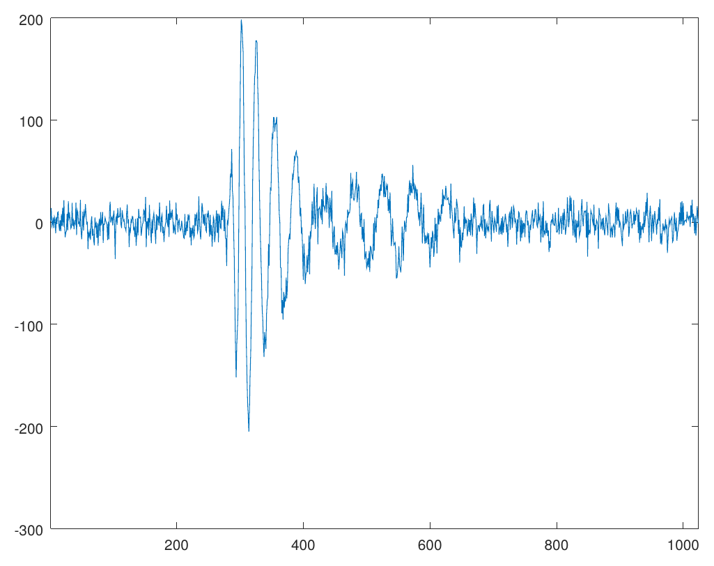
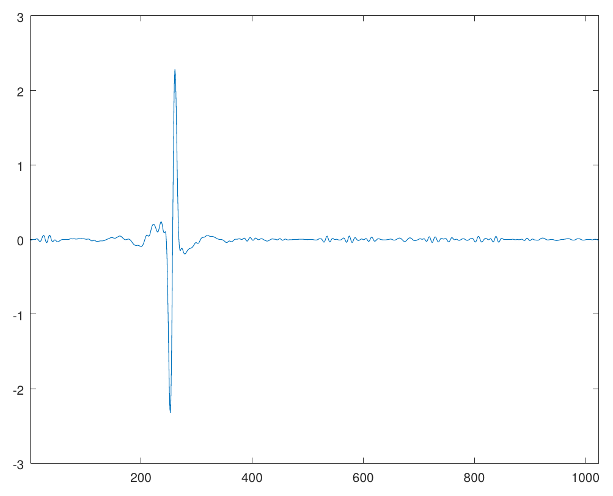
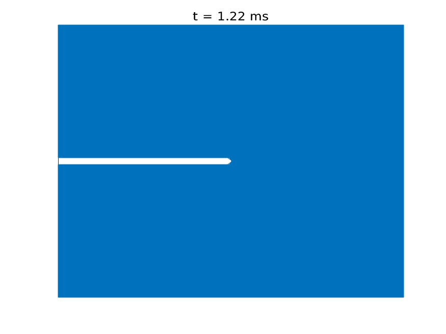



## Research Interests

I enjoy problems with a good mix of abstraction and applicability. I work on a variety of problems coming from 
* [Granular media](#granular-media) 
* [Nonlinear dispersive partial differential equations](#nonlinear-dispersive-equations)
* [Signal processing](#signal-processing)
* [Solid mechanics](#solid-mechanics) 
* [Machine learning](#machine-learning) 

[//]: this is a comment 

***

### Granular media
Modeling and simulating granular media are important for many industrial and geophysical applications. The shape of individual grains plays an important role in determining the mechanical response of the bulk. On the other hand, it is possible to design particle shapes so that the bulk has some desired property. For example, [doloses](https://en.wikipedia.org/wiki/Dolos) are used to protect seashores from the erosive force of waves.
Moreover, grain crushing affects the strength of the bulk. Therefore, simulating individual grains and modeling the interaction is crucial to understanding the collective behavior of the aggregate.

<video height="500" controls autoplay loop>
<source src="vid/vid_settle_plus0.2.mp4" type="video/mp4">
Your browser does not support the video tag.
</video> 

As a part of a Multidisciplinary University Research Initiative [(MURI)](https://muri-granulardna.sites.caltech.edu/) to understand granular media via grain-scale engineering, with [Prof. Robert Lipton](https://www.math.lsu.edu/~lipton/) I have studied the effect of particle shapes on the mechanical response of the aggregate, where the damage of individual grains is captured by peridynamics.

- _Simulating grain shape effects and damage in granular media using PeriDEM_ (with Robert P. Lipton) (Submitted) [arXiv](https://arxiv.org/abs/2108.07212)
- _Peridynamics-based discrete element method (PeriDEM) model of granular systems involving breakage of arbitrarily shaped particles_ (with Prashant K Jha, Prathamesh S Desai, and Robert P Lipton) Journal of the Mechanics and Physics of Solids, 2020. [doi](10.1016/j.jmps.2021.104376) [arXiv](https://arxiv.org/abs/2010.07218)

***

### Nonlinear Dispersive Equations
[Dispersive equations](https://en.wikipedia.org/wiki/Dispersive_partial_differential_equation) model the propagation of waves in various media. Nonlinearities make the study of dispersive equations more realistic, as well as mathematically interesting. For example, when the effect of nonlinearity opposes the effect of dispersion (focusing case), these equations exhibit peculiar solutions called [solitons](https://en.wikipedia.org/wiki/Soliton) that retain their spacial localization for a long time. [John Scott Russell](https://en.wikipedia.org/wiki/John_Scott_Russell) observed such solitary-waves in a shallow river in 1834. [Here](https://www.youtube.com/watch?v=w-oDnvbV8mY) is an experiment.

My work on nonlinear dispersive equations has been about the low-regularity theory, especially in the critical regime, where we can observe a dichotomy between global existence and blow-up of the solution in finite time, depending on the profile of the initial data. 
With [Svetlana Roudenko](https://case.fiu.edu/about/directory/people/svetlana-roudenko.html) and [Luiz Gustovo Farah](https://sites.google.com/site/lgfarah/), I have studied the Zakharov-Kuznetsov equation

  
$$
    v_t + \partial_x (\Delta v)  \pm \partial_x (v^{2}) = 0 
$$
  

 and its modifications, which model propagation of [ion-accoustic waves](https://en.wikipedia.org/wiki/Ion_acoustic_wave) in magnetized plasma. It is also one of the higher dimensional generalizations of the celebrated [Korteweg-de Vries equation](https://en.wikipedia.org/wiki/Korteweg%E2%80%93de_Vries_equation) that models shallow water waves.

The main tool used in my work on asymptotics of low-regularity data is known as the [*I*-method](https://web.archive.org/web/20120925081237/http://wiki.math.toronto.edu/DispersiveWiki/index.php/I-method), which was featured in 2006 Fields Medal [citations](http://www.icm2006.org/dailynews/fields_tao_info_en.pdf) for Terrence Tao. 
Using harmonic analytic tools like Fourier analysis and Littlewood-Payley analysis, we carefully investigate of the interaction of the constituent frequencies of the solution to establish an *almost conservation law* for the energy functional of a mollified solution. Using this law, we iterate the local existence theory finitely many times to establish the global well-posedness for rough data. On the other hand, we prove that low-regularity solutions which blow up in finite time have the property that the mass of the solutions concentrates inside a ball of shrinking radius. The main tools here are the *I*-method and an almost-orthogonal profile decomposition.

[//]: Currently, I am studying the inhomogeneous [nonlinear Schr&ouml;dinger](https://en.wikipedia.org/wiki/Nonlinear_Schr%C3%B6dinger_equation) and the [Hartree equation](https://en.wikipedia.org/wiki/Hartree_equation).

* _Global well-posedness for low regularity data in the 2d modified Zakharov-Kuznetsov equation_ with [Luiz Gustovo Farah](https://sites.google.com/site/lgfarah/) and [Svetlana Roudenko](https://case.fiu.edu/about/directory/people/svetlana-roudenko.html) 
J. Differential Equations, 268(12):7962–7997, 2020. [doi](https://doi-org.proxygw.wrlc.org/10.1016/j.jde.2019.11.092) [arXiv](https://arxiv.org/abs/1906.05822)
* _Mass-concentration of low-regularity blow-up solutions to the focusing 2D modified Zakharov-Kuznetsov equation_, Partial Differ. Equ. Appl. 2, 83 (2021). [doi](https://doi.org/10.1007/s42985-021-00139-y) [arXiv](http://arxiv.org/abs/2007.15773)

***

### Signal Processing
<!--Even though I was first exposed to Harmonic analysis as a tool to study dispersive equations, I became interested in its application in other areas of science, in particular signal processing, when I took a class on [frames](https://en.wikipedia.org/wiki/Frame_(linear_algebra)), [wavelets](https://en.wikipedia.org/wiki/Wavelet), time series analysis and [compressed sensing](https://en.wikipedia.org/wiki/Compressed_sensing) with [Prof. John Benedetto](https://www.math.umd.edu/~jjb/). -->

During Summer 2018, I had the opportunity to work with the [ANITA](https://en.wikipedia.org/wiki/Antarctic_Impulse_Transient_Antenna) collaboration, a research group conducting balloon experiments in the antarctic region with a goal to detect ultra-high energy neutrinos. Filtering out electro-magnetic noise picked up by the highly sensitive antennas of ANITA payload and de-blurring the signals is known as the [deconvolution problem](https://en.wikipedia.org/wiki/Deconvolution) in signal processing. I worked with the astrophysicists at the University of Hawai'i at Monoa under the supervision of [Peter Gorham](https://www.phys.hawaii.edu/~gorham/) on the deconvolution problem using Fourier and Wavelet analysis and implemented a C++ library called [libWTools](https://github.com/debdeepbh/libWTools). I am currently working on a multi-antenna generalization of this algorithm.

- _Unusual Near-Horizon Cosmic-Ray-like Events Observed by ANITA-IV_ (with P. W. Gorham et al.) Physical Review Letters, 2021. [doi](https://journals.aps.org/prl/abstract/10.1103/PhysRevLett.126.071103) [arXiv](https://arxiv.org/abs/2008.05690)
* Report on _Deconvolution problem and application to ANITA signals_, submitted to ANITA collaboration at University of Hawai'i at Manoa [[pdf]](/content/report-anita.pdf)
* _Generalized ForWaRD algorithm for multi-antenna model_ (Preprint)

|  |  |

*A blurred, noisy signal (left) is deconvolved (right) using the ForWaRD algorithm* [[code]](https://github.com/debdeepbh/numerical/tree/master/wavelet)

***

### Solid Mechanics
Understanding how solid materials deform and fail under external loading conditions has been a long-standing area of research for scientists and engineers for centuries. 
The classical approach is to treat the solids as a [continuum](https://en.wikipedia.org/wiki/Continuum_mechanics) and model the displacements of material points as a solution to a differential equation, known as the [Cauchy Momentum equation](https://en.wikipedia.org/wiki/Cauchy_momentum_equation).
However, due to the differential formulation, the classical theory fails to describe material behavior when the deformation field is non-differentiable at certain material points, for example, when a fracture is formed.

Introduced by [Stewart Silling](https://www.sandia.gov/~sasilli/) in 2000,  [peridynamics](https://en.wikipedia.org/wiki/Peridynamics) has become useful to address this limitations.
Peridynamics assumes that every material point interacts with its neighbors via a bond force and reformulates material deformation using an integral equation, thus accommodating discontinuous deformations, such as fractures. Peridynamics has been used to model crack formation and crack branching, among many other fracture problems.

 
*Simulation of crack propagation and branching in soda-lime glass with a pre-notch under external force in the outward vertical direction* [[code]](https://github.com/debdeepbh/numerical/tree/master/crack) 

Working with [Pablo Seleson](https://web.ornl.gov/~selesonpd/) and [Jeremy Trageser](https://cam.ornl.gov/jtrageser2.html) at the [Oak Ridge National Laboratory](https://www.ornl.gov/), 
I considered three-dimensional axisymmetric problems, where the geometry of the material is symmetric about an axis of symmetry and the external loading conditions are such that the deformation fields are symmetric about the same axis of symmetry. This is an important class of problem in solid mechanics where the symmetry can be exploited to reduce dimension of the problem. We derived the two-dimensional model that exactly represent the full 3D axisymmetric linear peridynamic model by incorporating out-of-plane bond forces into the representative 2D plane, thus reducing the computational cost significantly.

[//]: I am currently working on a similar treatment for the fully nonlinear 3D axisymmetric peridynamic model.

* Nonlocal fracture modeling with quasistatic loading with Robert Lipton (In preparation)
- Peridynamics for Quasistatic Fracture Modeling with Patrick Diehl and Robert P. Lipton. (Submitted) [arXiv](https://arxiv.org/abs/2107.14665)
* _Reduction of three-dimensional axisymmetric problems to two dimensions in Peridynamics_ with [Pablo Seleson](https://web.ornl.gov/~selesonpd/) and [Jeremy Trageser](https://cam.ornl.gov/jtrageser2.html) (Preprint)
* Report on _Reduction of three-dimensional axisymmetric problems to two dimensions in Peridynamics_, submitted to the NSF as part of [MSGI](https://orise.orau.gov/nsf-msgi/) program [[pdf]](/content/NSF-report-signed.pdf)

***

### Machine Learning

During Summer 2018, I was learning to use  popular machine lerning techniques using *scikit-learn* as yet another problem-solving tool. While documenting my understanding, I became more interested in the underlying mathematics of it.
With [Radu Balan](https://www.math.umd.edu/~rvbalan/) and Naveed Haghani, I am working on a 
 permutation-invariant encoding of finite-dimensional data points.

*  [My repository](https://github.com/debdeepbh/ml) to document notes and solved exercises from the book *Hands-On Machine Learning with Scikit-Learn and TensorFlow*
* _Permutation-invariant encoding of data in Eulidean space_, with [Radu Balan](https://www.math.umd.edu/~rvbalan/) and Naveed Haghani (In preparation)

***

